# Video Intelligence - ASP.NET Core Blazor, Azure AI Video Indexer, Azure OpenAI, Semantic Kernel

Video Intelligence extracts insights from your videos using Azure AI Video Indexer and generates documentation, surveys and emails with all information.

* [What can I do with Video Intelligence?](#what-can-i-do-with-video-intelligence?)
* [What problem is solving?](#what-problem-is-solving?)
* [Technology stack](#technology-stack)
* [Architecture diagram](#architecture-diagram)
* [Getting started](#getting-started)
* [Configuration](#configuration)
* [Deploying](#deploying)
* [Example](#example)


## What can I do with Video Intelligence?

Video Intelligence is an assistant specialized in understanding videos. It extracts insights from your videos to be used for:

* Content creation 
  * Web page about the content of the video - creates a web page with an exposition of the video, with images taken from relevant instants.
  * Summary of the video, or to list the topics discussed.
  * Quiz about the video - creates a webpage with multiple-choice questions, a button to check the answers, and an explanation about what would be the right answer and why.

* Comprehension
  * Deep search (finding moments in a video where a person spoke certain words).
  * Question answering about the content of the video.

* Communication
  * Improving content distribution to a diverse audience in different regions and languages by delivering content in multiple languages.
  * Sending an email with video content (including links to the video, documentation, summary, survey) to share with anyone.


## What problem is it solving?

Video Intelligence aims at helping people understanding the content of any video. It works with any kind of video, but we specially had in mind courses/lessons. It does a great job in summarizing and explaining the content of the video, with images taken from relevant instants, and the webpage creation is the perfect tool to have automatic notes. For instance, it will note down mathematical formulas and save the prominent images of slideshows/whiteboards. The quiz creation functionality is both useful to the student who wants to self-test his understanding of the lesson, and to the professor who wants a quick way to create tests. But education is not the only application field. Imagine being interested in the content of a long video of any type, e.g. news, documentary, opinions, but not having time: you may just process it with Video Intelligence and get your information summarized and explained in a webpage with images and notes. 
Imagine being interested in a topic and having found tens of videos which claim to cover topic, but you do not know if it is actually true, and you do not know for which level of expertise they are fit, or if they go deep in detail or are superficial. Trying to watch them all to see if they match your needs can be time-expensive, so you could just analyze them with Video Intelligence to produce a webpage for each, and then give a glance at it to check if the subject is the one you wanted, and the level of detail/expertise fits you well.

You can see an [example here](https://youtu.be/Q1uC0nnafxc) .


## Technology stack

* An [ASP.NET Core](https://dotnet.microsoft.com/en-us/apps/aspnet) that uses [Semantic Kernel](https://learn.microsoft.com/en-us/semantic-kernel/overview/) package to access language models to generate responses to user messages.
* A basic HTML/JS frontend that streams responses from the backend using JSON over a [ReadableStream](https://developer.mozilla.org/en-US/docs/Web/API/ReadableStream).
* A [Blazor](https://learn.microsoft.com/it-it/aspnet/core/blazor/?view=aspnetcore-9.0) frontend that streams responses from the backend. Using as initial app template the template [OpenAI + Semantic Kernel chat app quick start](https://azure.github.io/ai-app-templates/repo/azure-samples/ai-chat-quickstart-csharp/)
* Using the OpenAI through [Azure OpenAI](https://learn.microsoft.com/en-us/azure/ai-services/openai/overview). As LLM we used GPT-4.1, but this is easily replaceable by any other LLM of choice. Thanks to [AI Foundry](https://learn.microsoft.com/en-us/azure/ai-foundry/) with a couple of clicks you can deploy a different model and just change the model name string in the source code. 
* To analyze the video we used the [Azure AI Video Indexer](https://azure.microsoft.com/en-us/products/ai-video-indexer).
* To send emails we used [Azure Communication Services email](https://learn.microsoft.com/en-us/azure/communication-services/concepts/email/email-overview).


## Architecture diagram

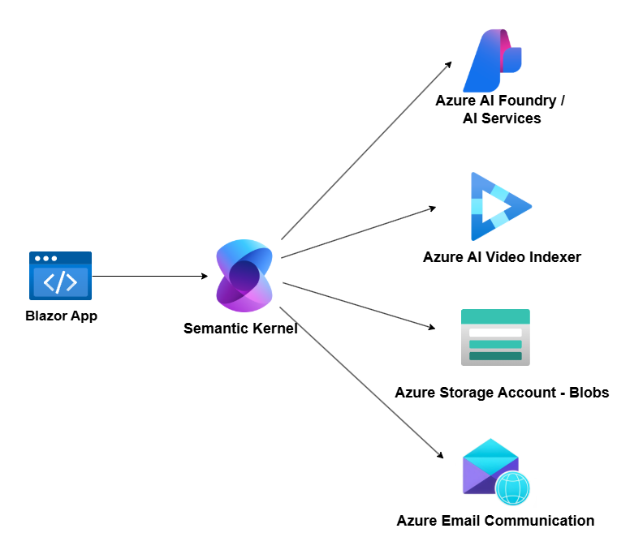


## Getting started

To get started with this project you have to set it up locally.

You'll need to:

1. Make sure the following tools are installed:

    * [.NET 9](https://dotnet.microsoft.com/downloads/)
    * [Git](https://git-scm.com/downloads)
    * [VS Code](https://code.visualstudio.com/Download) or [Visual Studio](https://visualstudio.microsoft.com/downloads/)
        * If using VS Code, install the [C# Dev Kit](https://marketplace.visualstudio.com/items?itemName=ms-dotnettools.csdevkit)

2. Download the project code.

3. If you're using Visual Studio, open the src/VideoIntelligence.sln solution file. If you're using VS Code, open the src folder.

4. Continue with the [deploying steps](#deploying).


## Configuration

Configure the app settings into the appsettings.json.

* [Azure OpenAI](https://azure.microsoft.com/en-us/products/ai-services/openai-service)

     ```json
    "AzureOpenAI": {
        "ModelName": "",
        "ModelEndpoint": "",
        "InferenceKey": ""
    }
    ```
* [Azure AI Video Indexer](https://azure.microsoft.com/en-us/products/ai-video-indexer)

    ```json
    "AzureVideoIndexer": {
        "AccountId": "",
        "ApiKey": "",
        "AccountLocation": ""
    }
    ```
* [Azure Blob Storage](https://azure.microsoft.com/en-us/products/storage/blobs)
    
    ```json
    "StorageAccount": {
        "ConnectionString": "",
        "ContainerName": ""
    },
    ```

* [Email Communication Service](https://learn.microsoft.com/en-us/azure/communication-services/concepts/email/email-overview)

    ```json
    "EmailCommunicationService": {
        "ConnectionString": "",
        "SenderAddress": ""
    }
    ```

## Deploying

Once you've opened the project locally, you can [deploy it to Azure](https://learn.microsoft.com/en-us/training/paths/deploy-a-website-with-azure-app-service/) or run it locally. 

## Example

This example is with the video ["College Physics 1: Lecture 9 - Motion With Constant Acceleration" by Spahn's Science Lectures](https://www.youtube.com/watch?v=6dBOdKpUUgA) .

### Upload a file.

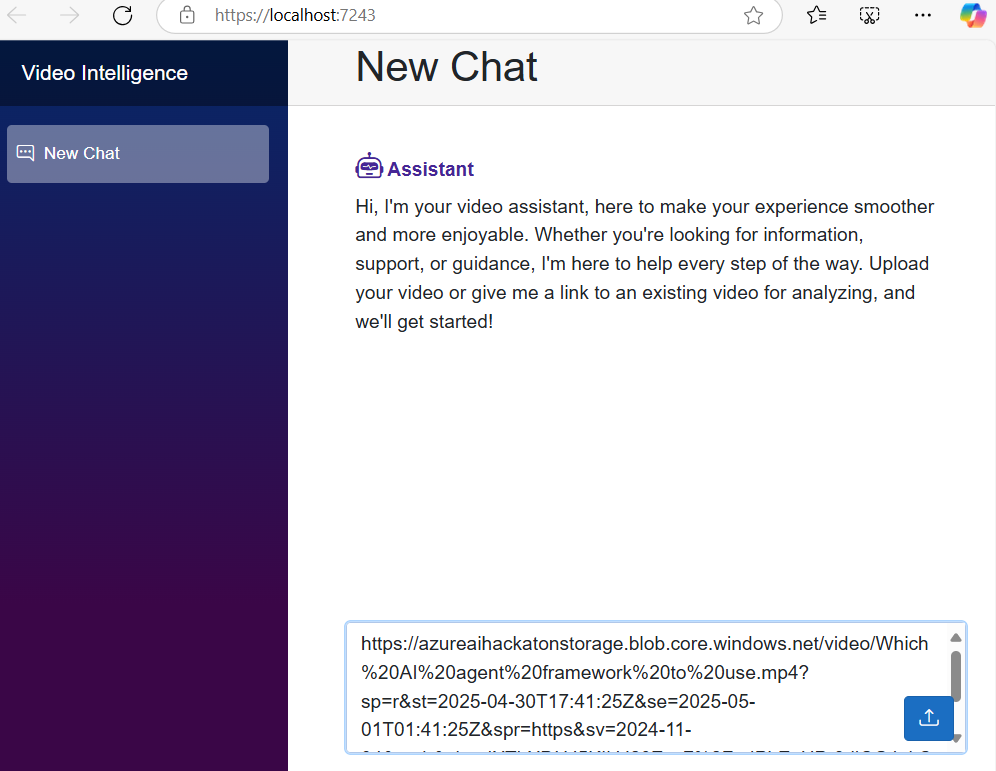


### When the video has been successfully uploaded ask to create a web page.

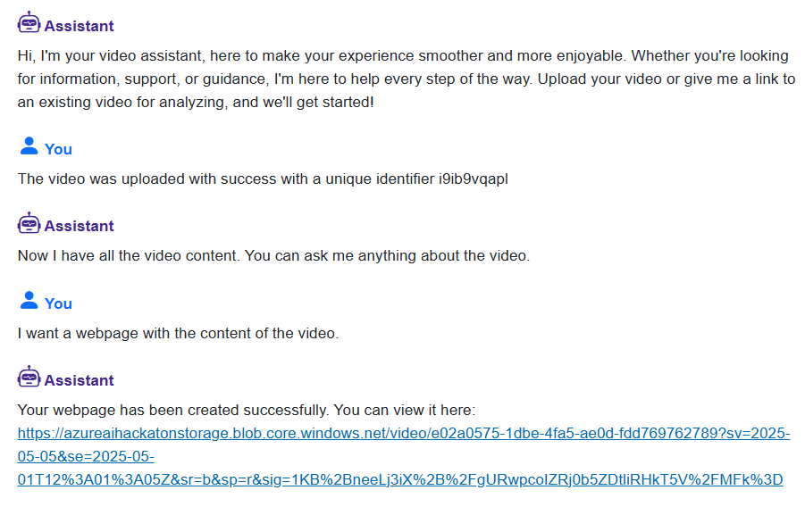

#### The web page created with an exposition of the video, with images taken from relevant instants.

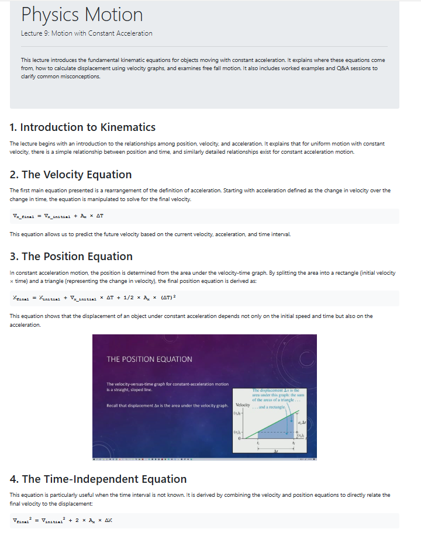


### Create a quiz.

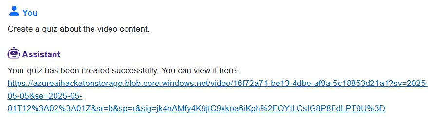

#### The web page created with the quiz.

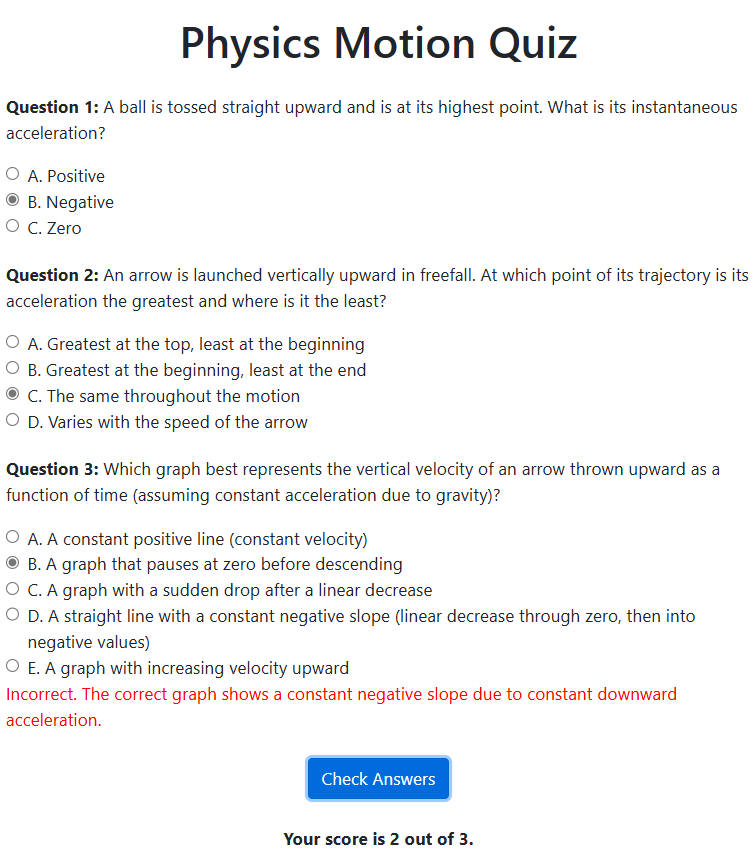


### Ask the exact point in the video where they speak about something.

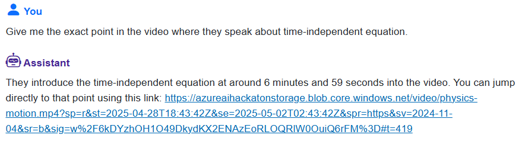

#### The link with the exact point in the video:

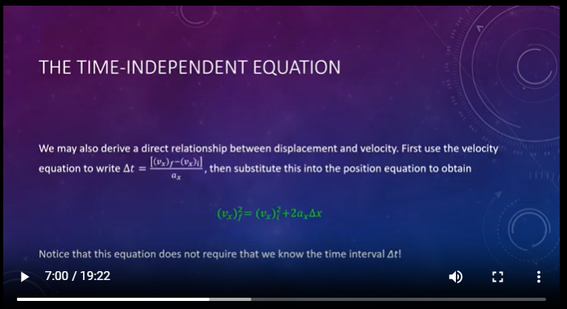


### Ask for explanation about some topic.

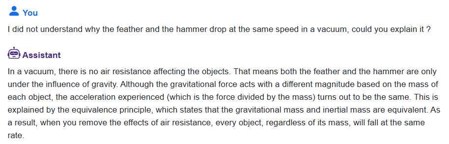


### Ask to send an email. 

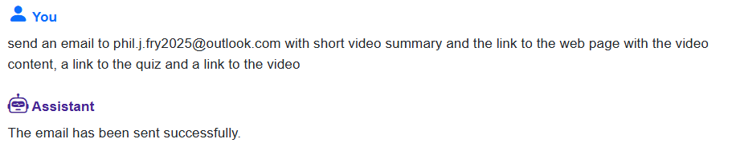

#### The email:

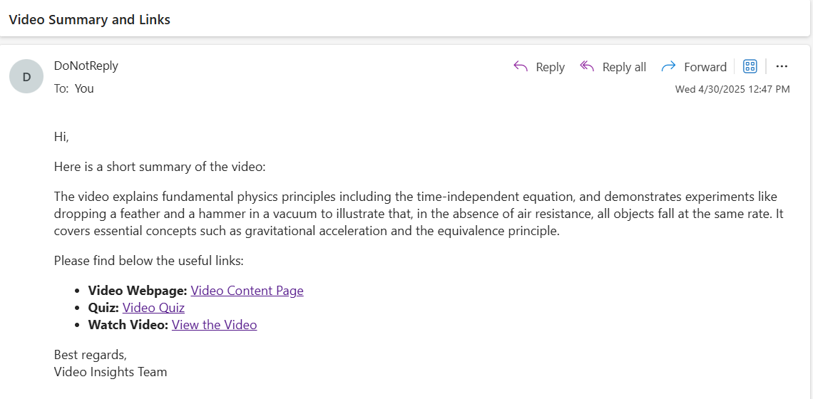


### Ask for translation

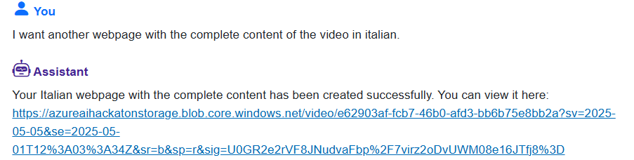

#### Created translation:

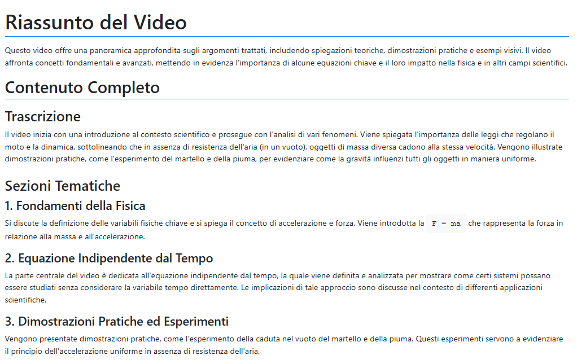
